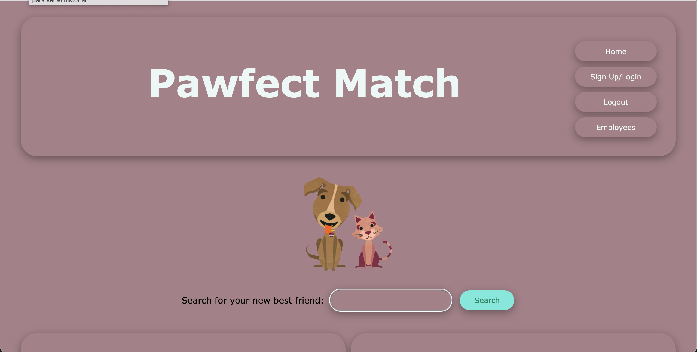
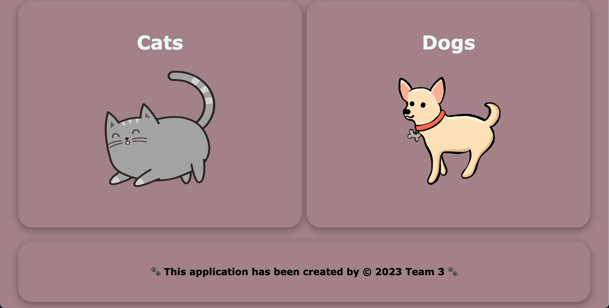
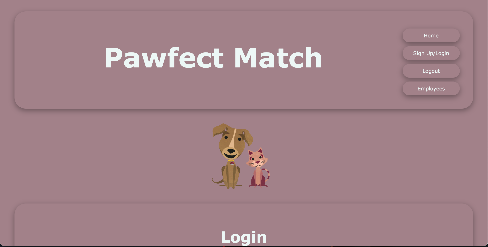
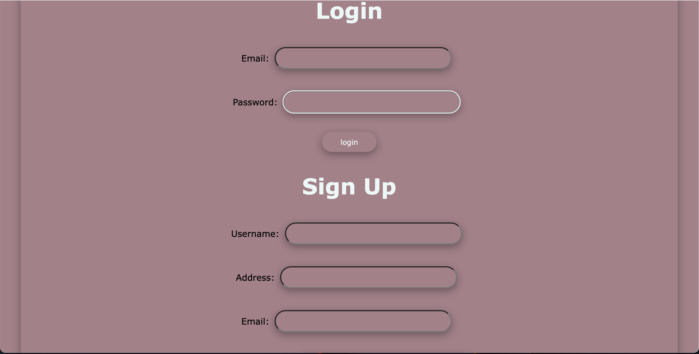
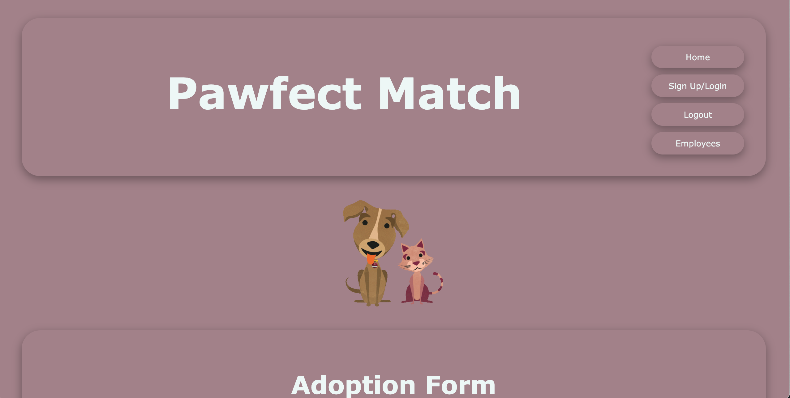
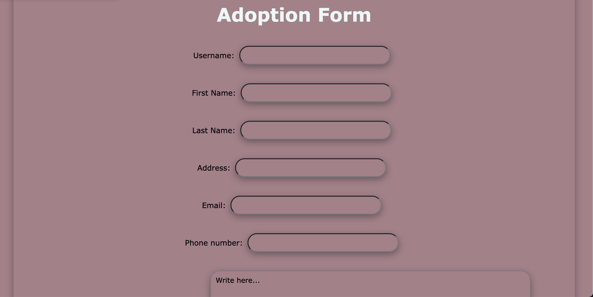
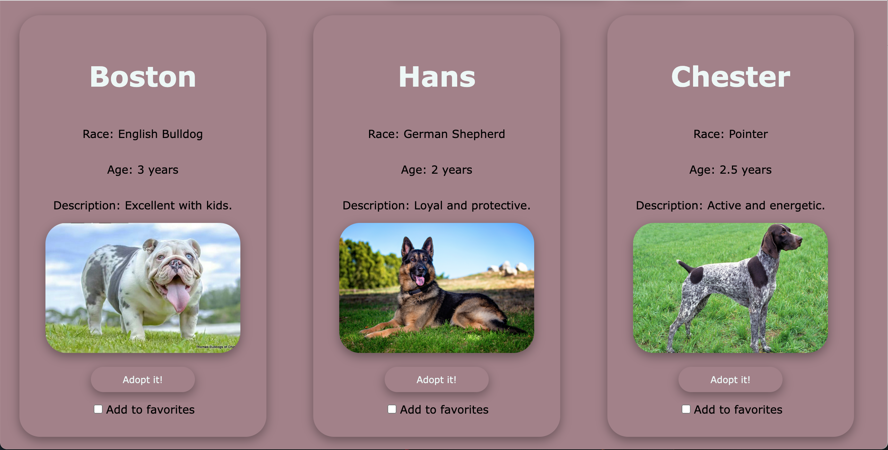

# Pawfect-Match

## Description

Finding a pet can be exciting and a good portion of individuals shop for their next pet to be. That, however, leaves many perfectly lovable animals alone in shelters that are available for adoption. The problem is having an easily accessible platform through which one can find the perfect pet to adopt.

Pawfect Match strives to solve this problem by streamlining the pet adoption process. By providing a comprehensive list of pets available for adoption online, potential pet owners can save themselves the hassle of visiting their local animal shelter.

For this project, the data will be pseudo in nature. In the future in a production style release, different shelters could contact the administrative staff at Pawfect Match to receive an employee account. Through this account, they can then upload animals from their shelter that are available for adoption to the Pawfect Match website for potential owners to view.


[](https://opensource.org/licenses/MIT)

## Table of Contents:

- [Overview](#Overview)
- [The Challenge](#The-Challenge)
- [User Story](#User-Story)
- [Acceptance Criteria](#Acceptance-Criteria)
- [Installation Instructions](#Installation-Instructions)
- [Usage Instructions](#Usage-Instructions)
- [Technologies Used](#Technologies-Used)
- [Deployed Application Link](#Deployed-Application-Link)
- [Screenshots](#Screenshots)
- [Test](#Test)
- [Questions](#Questions)
- [Credits](#Credits)
- [License](#License)

# Overview

## Challenge
"You and your group will use everything you’ve learned over the past six weeks to create a real-world full-stack application that you’ll be able to showcase to potential employers. The user story and acceptance criteria will depend on the project that you create, but your project must fulfil the following requirements:

* Use Node.js and Express.js to create a RESTful API.

* Use Handlebars.js as the templating engine.

* Use MySQL and the Sequelize ORM for the database.

* Have both GET and POST routes for retrieving and adding new data.

* Be deployed using Heroku (with data).

* Use at least one new library, package, or technology that we haven’t discussed.

* Have a polished UI.

* Be responsive.

* Be interactive (i.e., accept and respond to user input).

* Have a folder structure that meets the MVC paradigm.

* Include authentication (express-session and cookies).

* Protect API keys and sensitive information with environment variables.

* Have a clean repository that meets quality coding standards (file structure, naming conventions, follows best practices for class/id naming conventions, indentation, quality comments, etc.).

* Have a quality README (with unique name, description, technologies used, screenshot, and link to deployed application).

* Finally, you must add your project to the portfolio that you created in Module 2."

## User Story

```md
AS A USER,
I WANT a friendly and easy-to-access online platform with a database containing possible options for animals (dogs and cats) for adoption.,
SO THAT I can log in/create an account, review the options and select the one that best meets my expectations, submitting the adoption request in a simple and uncomplicated way.
```

## Acceptance Criteria

```md
GIVEN a friendly main website with excellent presentation,
WHEN I select the option sign-up,
THEN I am taken to a special page to create the access account,
WHEN I choose to log in when I already have a user account,
THEN I am directed to a special page to log in with my username and password,
WHEN I choose between dogs and cats,
THEN I am taken to a list of animals (cats or dogs) available for adoption,
WHEN I choose a new pet,
THEN I am taken to a page with an adoption form.
```

## Installation Instructions
This is an online Web Application deployed through Heroku, hence, it doesn't need user's installation.

## Usage Instructions
1. Open the web page using the link provided further in this README file, 
2. Sign-Up, 
3. Choose between cats and dogs, 
4. Take your time to review all the options available,
5. Whenever you are ready click on the "adopt it!" button,
6. Fulfil the Adoption form and submit the request.

## Technologies Used
- node.js [Version 16.18.1](https://nodejs.org/en/blog/release/v16.18.1/)
- Express.js [Version 4.16.4](https://expressjs.com/)
- dotenv [Version 16.3.1](https://www.npmjs.com/package/dotenv)
- mysql2 [Version 3.6.2](https://www.npmjs.com/package/mysql2)
- sequelize [Version 6.33.0](https://www.npmjs.com/package/sequelize)
- Visual Studio Code: [Website](https://code.visualstudio.com/)

## Deployed Application Link
[Pawfect Match](https://lit-caverns-39901-b1b0838a840a.herokuapp.com/)

## Screenshots








## Test
This application has been tested by using Insomnia as well as running it several times adding information to the databases, and requesting adoptions.

## Questions?
If you have any questions related with Pawfect Match, feel free to reach us through:

### Email:

[kiry362@gmail.com](kiry362@gmail.com)

[baljotshansi@gmail.com](baljotshansi@gmail.com)

[matthewthompson118@gmail.com](matthewthompson118@gmail.com)

[fibarrafdec@gmail.com](fibarrafdec@gmail.com)

### GitHub username:

[Kirill777-web](https://github.com/Kirill777-web)

[bhansi](https://github.com/bhansi)

[MattThompson15](https://github.com/MattThompson15)

[fibarrafdec](https://github.com/fibarrafdec)

## Credits
This application has been created by © 2023 Team 3.

Front end: Matt Thompson and Fernando Ibarra.

Back end: Kirill Lazutin and Baljot Hansi.

## License & Copyright ©
This application is covered under the MIT License.
[](https://opensource.org/licenses/MIT)

### Copyright © 2023 Team 3
```md
Permission is hereby granted, free of charge, to any person obtaining a copy
of this software and associated documentation files (the "Software"), to deal
in the Software without restriction, including without limitation the rights
to use, copy, modify, merge, publish, distribute, sublicense, and/or sell
copies of the Software, and to permit persons to whom the Software is
furnished to do so, subject to the following conditions:

The above copyright notice and this permission notice shall be included in all
copies or substantial portions of the Software.

THE SOFTWARE IS PROVIDED "AS IS", WITHOUT WARRANTY OF ANY KIND, EXPRESS OR
IMPLIED, INCLUDING BUT NOT LIMITED TO THE WARRANTIES OF MERCHANTABILITY,
FITNESS FOR A PARTICULAR PURPOSE AND NONINFRINGEMENT. IN NO EVENT SHALL THE
AUTHORS OR COPYRIGHT HOLDERS BE LIABLE FOR ANY CLAIM, DAMAGES OR OTHER
LIABILITY, WHETHER IN AN ACTION OF CONTRACT, TORT OR OTHERWISE, ARISING FROM,
OUT OF OR IN CONNECTION WITH THE SOFTWARE OR THE USE OR OTHER DEALINGS IN THE
SOFTWARE.
```